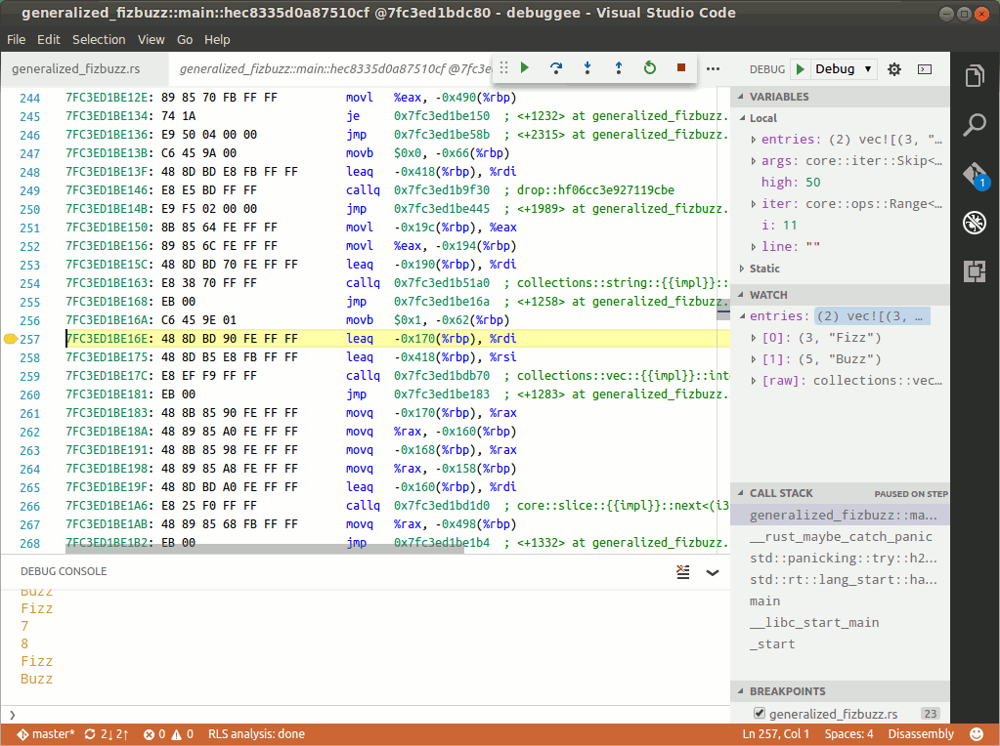
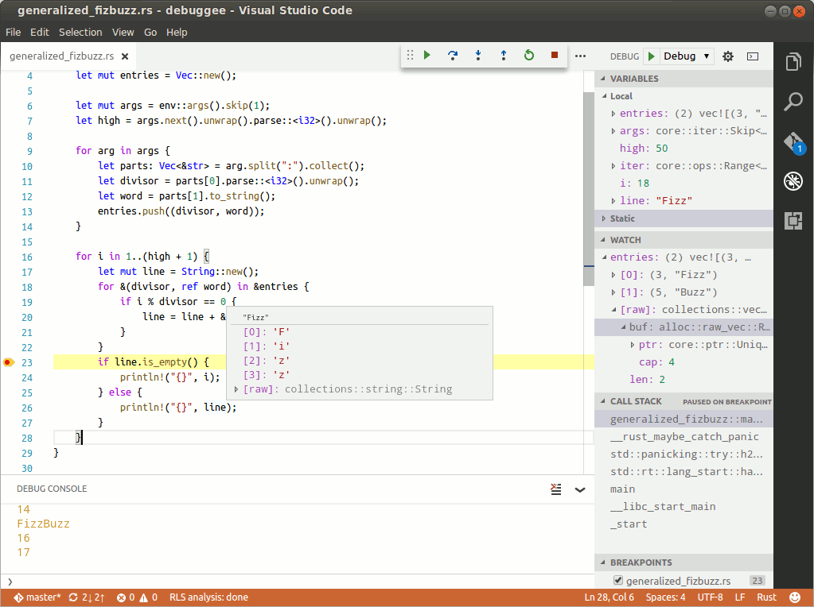

# Table of Contents

- [Starting a Debug Session](#starting-a-debug-session)
    - [Launching](#launching)
        - [Configuring Stdio](#stdio)
    - [Attaching](#attaching)
    - [Custom Launch](#custom-launch)
    - [Remote Debugging](#remote-debugging)
    - [Loading a Core Dump](#loading-a-core-dump)
    - [Source Path Remapping](#source-path-remapping)
- [Debugger Features](#debugger-features)
    - [Regex Breakpoints](#regex-breakpoints)
    - [Conditional Breakpoints](#conditional-breakpoints)
    - [Disassembly View](#disassembly-view)
    - [Formatting of Results](#formatting)
    - [Expressions](#expressions)
    - [Debugger API](#debugger-api)
- [Rust Language Support](#rust-language-support)
- [Workspace Configuration](#workspace-configuration)

# Starting a Debug Session

To start a debug session you will need to create a [launch configuration](https://code.visualstudio.com/Docs/editor/debugging#_launch-configurations) for your program:

## Launching
|parameter          |type|req |         |
|-------------------|----|:--:|---------|
|**name**           |string|Y| Launch configuration name.|
|**type**           |string|Y| Set to `lldb`.|
|**request**        |string|Y| Set to `launch`.|
|**program**        |string|Y| Path to the debuggee executable.|
|**args**           |string &#10072; [string]| | Command line parameters.  If this is a string, it will be split using shell-like syntax.|
|**cwd**            |string| | Working directory.|
|**env**            |dictionary| | Additional environment variables.  Tip: you may refer to existing environment variables like so: `${env.VARIABLE}`.|
|**stdio**          |string &#10072; [string] &#10072; dictionary| | See [Stdio Configuration](#stdio).|
|**terminal**       |string| | Destination for debuggee's stdio streams: <ul><li>`console` (default) for Debug Console</li><li>`integrated` for VSCode integrated terminal</li><li>`external` for a new terminal window</li></ul>
|**stopOnEntry**    |boolean| | Whether to stop debuggee immediately after launching.|
|**initCommands**   |[string]| | LLDB commands executed upon debugger startup.|
|**preRunCommands** |[string]| | LLDB commands executed just before launching the debuggee.|
|**exitCommands**   |[string]| | LLDB commands executed at the end of debugging session.|
|**sourceLanguages**|[string]| | A list of source languages used in the program. This is used to enable language-specific debugger features.|
|**sourceMap**      |dictionary| | See [Source Path Remapping](#source-path-remapping).|

### Stdio
The **stdio** property is a list of redirection targets for each of debuggee's stdio streams:
- `null` (default) will connect the stream to a terminal (as specified by the **terminal** launch property)<sup>1</sup>.
- `"/some/path"` will cause the stream to be redirected to the specified file, pipe or TTY device <sup>2</sup>.

For example, `"stdio": [null, null, "/tmp/my.log"]` will connect stdin and stdout to a terminal, while sending
stderr to the specified file.
- You may also use dictionary syntax: `"stdio": { "stdin": null, "stdout": null, "stderr": "/tmp/my.log" }`.
- A scalar value will configure all three streams identically: `"stdio": null`.

<sup>1</sup> On Windows debuggee is always launched in a new window, however stdio streams may still be redirected
as described above.
<sup>2</sup> Use `tty` command inside a terminal window to find out its TTY device path.

## Attaching
Note that attaching to a running process may be [restricted](https://en.wikipedia.org/wiki/Ptrace#Support)
on some systems.  You may need to adjust system configuration to enable it.

|parameter          |type    |req |         |
|-------------------|--------|:--:|---------|
|**name**           |string  |Y| Launch configuration name.|
|**type**           |string  |Y| Set to `lldb`.|
|**request**        |string  |Y| Set to `attach`.|
|**program**        |string  |Y| Path to debuggee executable.|
|**pid**            |number  | | Process id to attach to.  **pid** may be omitted, in which case debugger will attempt to locate an already running instance of the program. You may also put `${command.pickProcess}` here to choose a process interactively.|
|**stopOnEntry**    |boolean | | Whether to stop the debuggee immediately after attaching.|
|**initCommands**   |[string]| | LLDB commands executed upon debugger startup.|
|**preRunCommands** |[string]| | LLDB commands executed just before attaching to debuggee.|
|**exitCommands**   |[string]| | LLDB commands executed at the end of debugging session.|
|**sourceLanguages**|[string]| | A list of source languages used in the program.  This is used to enable language-specific debugger features.|
|**sourceMap**      |dictionary| | See [Source Path Remapping](#source-path-remapping).|

## Custom Launch

The custom launch method puts you in complete control of how the debuggee process is created.  This
happens in three steps:

1. `initCommands` sequence is executed.  It is responsible for creation of the debug target.
2. Debugger configures breakpoints using the target created in step 1.
3. `preRunCommands` sequence is executed.  It is responsible for creation of (or attaching to) the debuggee process.

|parameter          |type    |req |         |
|-------------------|--------|:--:|---------|
|**name**           |string  |Y| Launch configuration name.|
|**type**           |string  |Y| Set to `lldb`.|
|**request**        |string  |Y| Set to `launch`.|
|**custom**         |bool    |Y| Set to `true`.|
|**initCommands**   |[string]| | A sequence of commands that creates debug target.|
|**preRunCommands** |[string]| | A sequence of commands that creates debuggee process.|
|**exitCommands**   |[string]| | LLDB commands executed at the end of debugging session.|
|**sourceLanguages**|[string]| | A list of source languages used in the program.  This is used to enable language-specific debugger features.|
|**sourceMap**      |dictionary| | See [Source Path Remapping](#source-path-remapping).|

## Remote debugging

For general information on remote debugging please see [LLDB Remote Debugging Guide](http://lldb.llvm.org/remote.html).

### Connecting to lldb-server agent
- Run `lldb-server platform --server --listen *:<port>` on the remote machine.
- Create launch configuration similar to this:
```javascript
{
    "name": "Remote launch",
    "type": "lldb",
    "request": "launch",
    "program": "${workspaceRoot}/build/debuggee", // Local path.
    "initCommands": [
        "platform select <platform>",
        "platform connect connect://<remote_host>:<port>"
    ],
}
```
See `platform list` for a list of available remote platform plugins.

- Start debugging as usual.  The executable identified in the `program` property will
be automatically copied to `lldb-server`'s current directory on the remote machine.
If you require additional configuration of the remote system, you may use `preRunCommands` script
to execute commands such as `platform mkdir`, `platform put-file`, `platform shell`, etc.
(See `help platform` for a list of available platform commands).

### Connecting to gdbserver agent
- Run `gdbserver *:<port> <debuggee> <debuggee args>` on the remote machine.
- Create a custom launch configuration:
```javascript
{
    "name": "Remote attach",
    "type": "lldb",
    "request": "launch",
    "custom": true,
    "initCommands": ["target create ${workspaceRoot}/build/debuggee"],
    "preRunCommands": ["gdb-remote <remote_host>:<port>"]
}
```
- Start debugging.

## Loading a Core Dump
Use custom launch with `target crate -c <core path>` init command:
```javascript
{
    "name": "Core dump",
    "type": "lldb",
    "request": "launch",
    "custom": true,
    "initCommands": ["target create -c ${workspaceRoot}/core"],
}
```

## Source Path Remapping
Source path remapping is helpful in cases when program's source code is located in a different
directory then it was in during the build (for example, if a build server was used).

A source map consists of pairs of "from" and "to" path prefixes.  When debugger encounters a source
file path beginning with one of the "from" prefixes, it will automatically replace it with the
corresponding "to" prefix.  Example:
```javascript
    "sourceMap": { "/old/path/*/to/source/" : "/the/new/source/path/" }
```
- "from" prefixes may contain shell globs (`?`, `*`, `[abc]`, `[!abc]`).  If you need to
use one of the meta-characters verbatim, enclose it in brackets (`[?]` matches `?`).
- "to" prefixes may be null, which will cause CodeLLDB to ignore the matching files.

# Debugger Features

## Regex Breakpoints
Function breakpoints prefixed with '`/re `', are interpreted as regular expressions.
This causes a breakpoint to be set in every function matching the expression.
The list of created breakpoint locations may be examined using `break list` command.

## Conditional Breakpoints
You may use any of the supported expression [syntaxes](#expressions) to create breakpoint conditions.
When a breakpoint condition evaluates to False, the breakpoint will not be stopped at.
Any other value (or expression evaluation error) will cause the debugger to stop.

## Disassembly View
When execution steps into code for which debug info is not available, CodeLLDB will automatically
switch to disassembly view.  This behavior may be controlled using `LLDB: Show Disassembly`
and `LLDB: Toggle Disassembly` commands.  The former allows to choose between `never`,
`auto` (the default) and `always`, the latter toggles between `auto` and `always`.

While is disassembly view, the 'step over' and 'step into' debug actions will perform instruction-level
stepping rather than source-level stepping.



## Formatting
You may change the default display format of evaluation results using the `LLDB: Display Format` command.

When evaluating expressions in Debug Console or in Watch panel, you may control formatting of
individual expressions by adding one of the suffixes listed below.  For example evaluation of `var,x`
will display the value of `var` formatted as hex.

|suffix|format |
|:-----:|-------|
|**x**  | Hex |
|**o**  | Octal |
|**d**  | Decimal |
|**u**  | Unsigned decimal |
|**b**  | Binary |
|**f**  | Float (reinterprets bits, no casting is done) |
|**p**  | Pointer |
|**s**  | C string |
|**y**  | Bytes |
|**Y**  | Bytes with ASCII |

## LLDB Commands
To access LLDB features not exposed via the VS Code UI, you may enter
[LLDB commands](http://lldb.llvm.org/tutorial.html) directly into the Debug Console.

If you would like to evaluate an expression instead, prefix it with '`?`', e.g. `?a+b`.

## Expressions

CodeLLDB implements three expression syntaxes:

### Simple expressions
Simple expressions are used by default in all contexts, including Debug Console evaluator, Watch
panel and conditional breakpoints.
They may consist of variables and most of the Python operators (however, no keywords are allowed).<br>
Simple expressions are layered on top of the view of debuggee's types provided by LLDB's variable
formatters (such as the built-in formatters for C++ and Rust), so things like indexing
`std::vector` with an integer, or comparing `std::string` to a string literal should just work.

### Python expressions
Prefix: `/py `<br>
Python expressions allow usage of normal Python syntax.  In addition to this, any identifier prefixed
with `$`, will be substituted with the value of the corresponding debuggee variable.
Such values may be mixed with regular Python variables.  For example `/py [math.sqrt(x) for x in $a]`
will evaluate to a list containing square roots of the values contained in debuggee's array `a`.

### Native expressions
Prefix: `/nat `<br>
These use LLDB built-in expression evaluators.  The specifics depend on the source language of the
current debug target (e.g. C, C++ or Swift).  For unknown languages LLDB will default to the
C++ expression syntax, which offers many powerful features, including interactive definition of new
data types, instantiation of C++ classes, invocation of functions and class methods, and more.

Note, however, that native evaluators ignore data formatters and operate of "raw" data structures.

## Debugger API

CodeLLDB provides a Python API via the `debugger` module (which is auto-imported into
debugger's main script context).

### debugger.evaluate(expression: str) -> Value
Allows dynamic evaluation of [simple expressions](#simple-expressions).

### debugger.unwrap(obj: Value) -> lldb.SBValue
Extract lldb.SBValue from the result of evaluation of a simple expression.

### debugger.wrap(obj: lldb.SBValue) -> Value
Converts lldb.SBValue to an object the may be used in [simple expressions](#simple-expressions).

### debugger.stop_if(condition: bool, handler: Callable[]) -> bool
If `condition` evaluates to True, executes the `handler` function and returns True.  Otherwise,
returns False.<br>
This function is handy when creating conditional breakpoints with side effects.
For example, this breakpoint condition: `/py debugger.stop_if($x % 50 == 0, lambda: print($y))` will
cause a stop when variable `x` becomes a multiple of 50 and will print the value of variable `y`.

### debugger.display_html(uri: str, title: str=None, position: int=None, content: Dict[string, string]={})
Displays HTML content in VSCode UI.
- `url`: URL of the main content.  Most likely you'll want to use a `debugger:` URL.
- `title`: Title of the HTML view tab.
- `position`: Position of the tab.  The allowed range is 1 through 3.
- `content`: A dictionary of static content indexed by URLs.  All keys must use the `debugger:` URL
  scheme.  All values must be strings (binary content such as images is not supported).

### debugger.register_content_provider(provider: Callable[[string],string])
Allows generation of dynamic content for HTML display.  Any `debugger:` content not found in the `content`
dictionary, will be directed to the `provider` callback, which takes a URL parameter and
returns content string.

# Rust Language Support

CodeLLDB supports visualization of most common Rust data types:
- Built-in types: tuples, enums, arrays, array and string slices.
- Standard library types: Vec, String, CString, OSString.

To enable this feature, add `"sourceLanguages": ["rust"]` into your launch configuration.

Note: There is a known incompatibility of debug info emitted by `rustc` and LLDB 3.8:
you won't be able to step through code or inspect variables if you have this version.
The workaround is to use either LLDB 3.7 or 3.9.  On macOS, LLDB shipped with Xcode 8 is known to
have this problem fixed.



# Workspace Configuration

There are a few CodeLLDB parameters that may be configured at the workspace level (or globally):

|parameter           |                                                         |
|--------------------|---------------------------------------------------------|
|**lldb.executable** |Path to LLDB executable. (default="lldb")                |
|**lldb.environment**|Environment variables to set for LLDB as `{"key":"value"}`.  You may use existing environment variables in values, for example `{"PATH" : "${env:HOME}/bin:${env:PATH}"}` |
|**lldb.parameters** |Startup parameters of the debug adapter                  |
|... **logLevel**         |"Logging level as defined by Python's 'logging' module. |
|... **reverseDebugging** |Enable reverse debuggee execution. (Experimental! Works with gdb-server and rr backends only!)|
