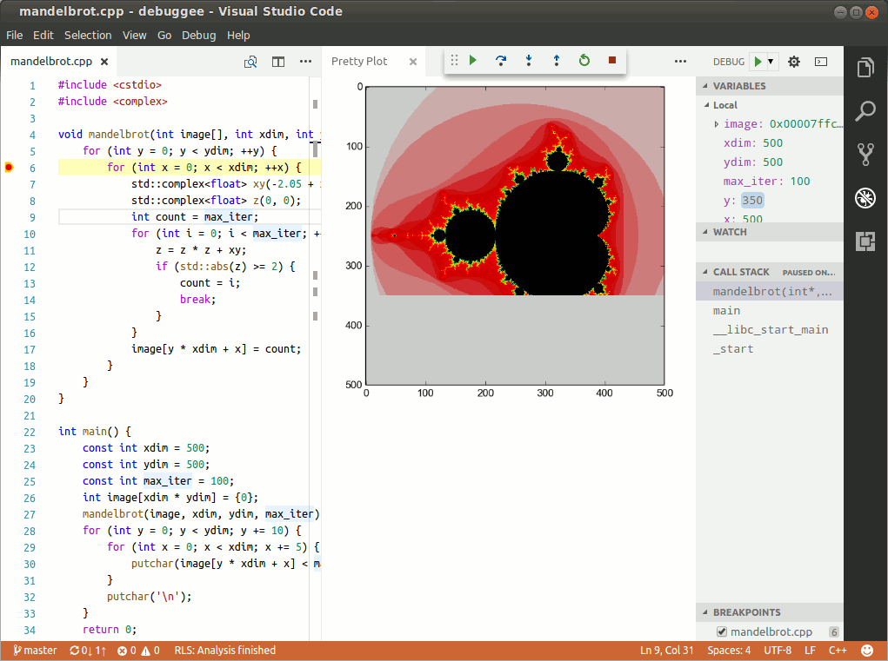

# Features
- Debugging on Linux (x64 or ARM), macOS and Windows<sup>*</sup>,
- Conditional breakpoints, function breakpoints, data breakpoints, logpoints,
- Launch debuggee in integrated or external terminal,
- Disassembly view with instruction-level stepping,
- Loaded modules view,
- Python scripting,
- HTML rendering for advanced visualizations,
- Rust language support with built-in visualizars for vectors, strings and other standard types,
- Global and workspace defaults for launch configurations,
- Remote debugging,
- Reverse debugging (experimental, requires compatible backend).

<sup>\*</sup> DWARF debug info format recommended, limited support for MS PDB.

For full details please see the [Users Manual](MANUAL.md).

# Requirements
- 64-bit OS
    - Linux: glibc 2.18 (available by default in Debian 8, Ubuntu 14.04, Centos 8)
    - Mac: OS X 10.10 Yosemite
    - Windows: 10.0
- 64-bit Python 3.5 or later (optional, except on Windows).

# Quick Start
Here's a minimal debug configuration to get you started:
```javascript
{
    "name": "Launch",
    "type": "lldb",
    "request": "launch",
    "program": "${workspaceFolder}/<my program>",
    "args": ["-arg1", "-arg2"],
}
```

# Links
- [Users Manual](MANUAL.md)
- [Debugging in VS Code](https://code.visualstudio.com/docs/editor/debugging)
- [Troubleshooting](https://github.com/vadimcn/vscode-lldb/wiki/Troubleshooting)
- [Wiki](https://github.com/vadimcn/vscode-lldb/wiki)
- [Chat](https://gitter.im/vscode-lldb/QnA)


# Screenshots

C++ debugging with data visualization ([Howto](https://github.com/vadimcn/vscode-lldb/wiki/Data-visualization)):<br>

<br>
<br>
Rust debugging:<br>


